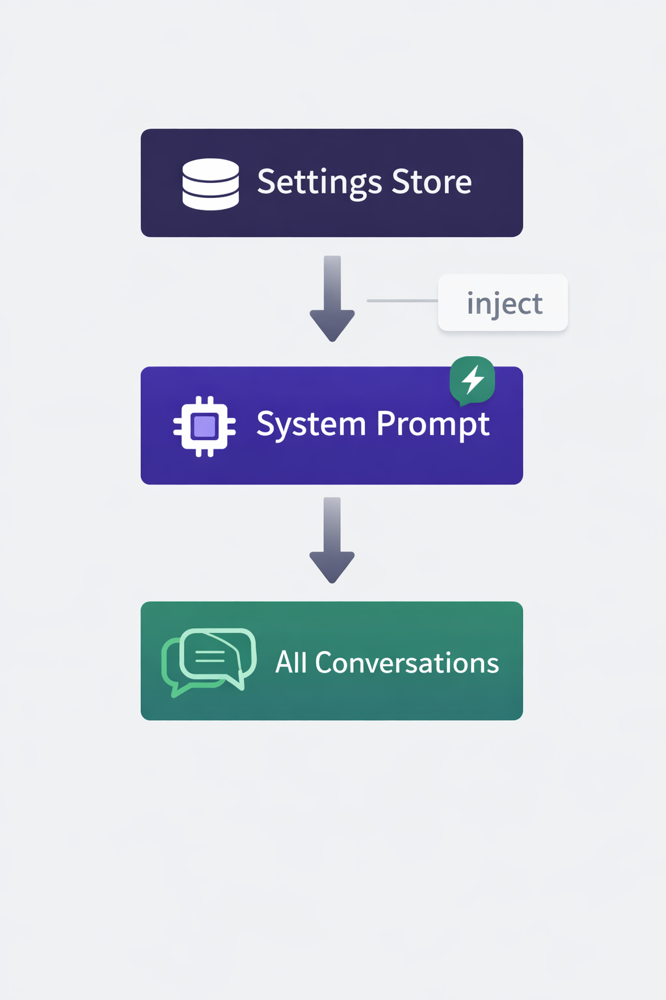
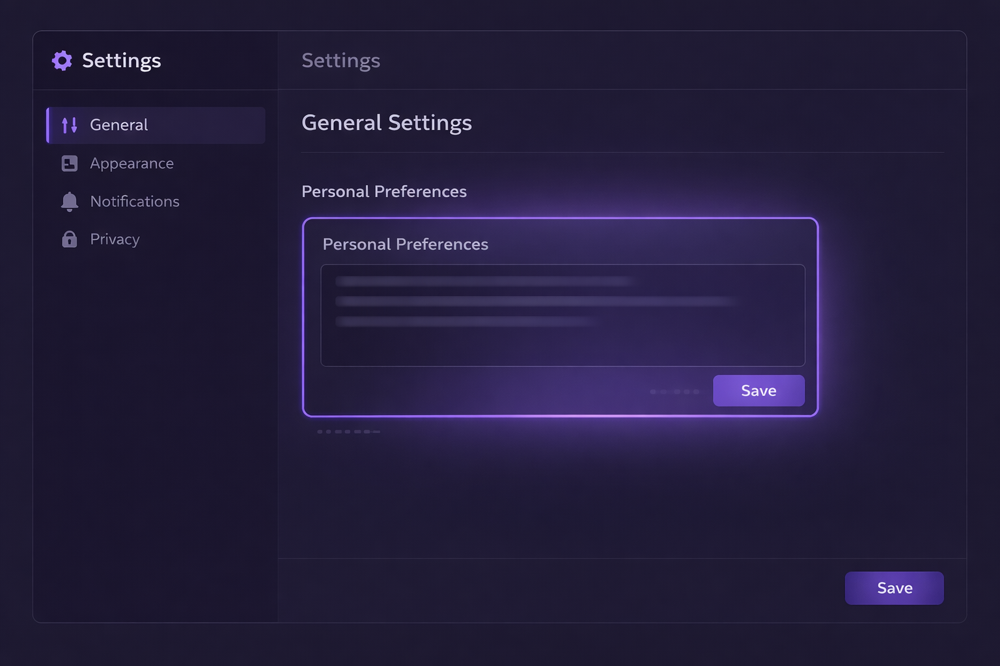
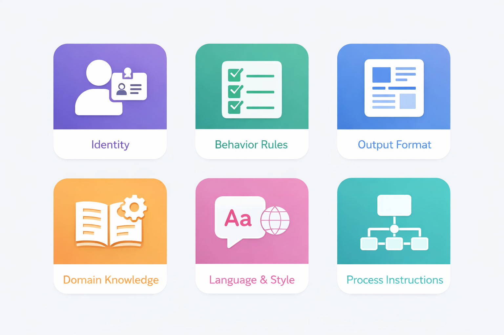
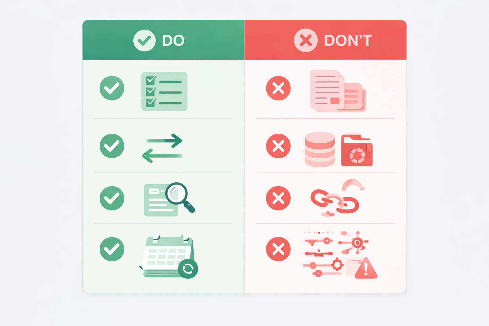
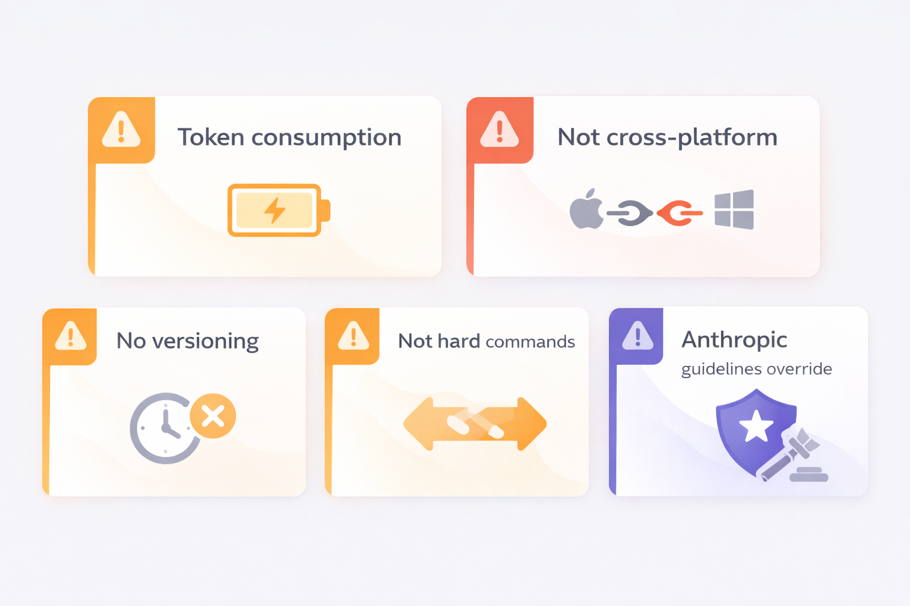

# Claude Personal Preferences — Hướng dẫn cấu hình hành vi AI theo ý muốn

## Mục lục
- [1. Personal Preferences là gì?](#1-personal-preferences-là-gì)
- [2. Cơ chế hoạt động](#2-cơ-chế-hoạt-động)
- [3. Cách truy cập và cài đặt](#3-cách-truy-cập-và-cài-đặt)
- [4. Các loại preferences phổ biến](#4-các-loại-preferences-phổ-biến)
- [5. Ví dụ thực tế theo nhóm người dùng](#5-ví-dụ-thực-tế-theo-nhóm-người-dùng)
- [6. Best practices khi viết preferences](#6-best-practices-khi-viết-preferences)
- [7. So sánh với các phương thức cấu hình khác](#7-so-sánh-với-các-phương-thức-cấu-hình-khác)
- [8. Giới hạn & lưu ý](#8-giới-hạn--lưu-ý)
- [9. Nguồn tham khảo](#9-nguồn-tham-khảo)

---

## 1. Personal Preferences là gì?

<!-- TODO: Tạo ảnh minh hoạ — infographic tổng quan "What is Personal Preferences"
     Phong cách: flat illustration, nền sáng
     Nội dung cần thể hiện: icon Claude + màn hình settings + mũi tên → conversations
     Màu sắc: tím #534AB7, xanh lá #1D9E75 -->


*Fig-01 — Tổng quan "What is Personal Preferences"*


**Personal Preferences** (hay "Profile Preferences") là tính năng cho phép bạn cấu hình toàn bộ hành vi của Claude một lần duy nhất — và áp dụng tự động cho **mọi cuộc hội thoại** sau đó, không cần giải thích lại.

Đây là một **text field tự do** đặt tại `Settings → General → What personal preferences should Claude consider in responses?` trên Claude.ai.

### Tại sao đây là tính năng bị bỏ qua nhiều nhất?

Hầu hết người dùng Claude mới chỉ dừng lại ở việc gõ prompt. Nhưng mỗi lần bắt đầu hội thoại mới, Claude "không nhớ" bạn là ai, bạn thích phong cách gì, hay bạn làm việc trong lĩnh vực nào. Kết quả: bạn phải lặp đi lặp lại cùng một đoạn "giới thiệu bản thân" mỗi ngày.

Personal Preferences giải quyết đúng vấn đề đó【[1](https://support.claude.com/en/articles/10185728-understanding-claude-s-personalization-features)】.

> "Personal Preferences là lần cài đặt đầu tiên bạn nên làm ngay khi bắt đầu dùng Claude."
> — Chris Primett, AI Productivity Coach

---

## 2. Cơ chế hoạt động

<!-- TODO: Tạo ảnh minh hoạ — sơ đồ kiến trúc "Personal Preferences Injection Flow"
     Phong cách: clean technical diagram
     Nội dung: 3 tầng (Settings store → System Prompt → Conversation)
     Màu sắc: tím #534AB7 cho System Prompt layer, xanh lá cho conversation -->


*Fig-02 — Kiến trúc "Personal Preferences Injection Flow"*

Khi bạn bắt đầu một cuộc hội thoại mới với Claude, hệ thống thực hiện theo trình tự sau:

```
[Personal Preferences bạn đã lưu]
          ↓  inject vào
[System Prompt của Claude]
          +
[Nội dung hội thoại của bạn]
          ↓
[Claude xử lý với đầy đủ context]
```

### Điểm quan trọng

- **Tự động:** Bạn không cần làm gì — preferences tự được nhúng vào mỗi conversation
- **Ưu tiên cao:** Preferences nằm ở đầu context, Claude đọc trước khi xử lý bất kỳ nội dung nào
- **Toàn cục:** Áp dụng trên web, mobile, API conversations (khi dùng Claude.ai)
- **Tiêu tốn token:** Mỗi từ bạn viết trong preferences = token bị tiêu thụ ở *mỗi* hội thoại【[2](https://www.jdhodges.com/blog/claude-ai-custom-instructions-a-real-example-that-actually-works/)】

### Khác biệt với Memory

| | Personal Preferences | Memory |
|---|---|---|
| Ai điều khiển? | Bạn viết thủ công | Claude tự tổng hợp |
| Nội dung | Quy tắc hành vi, context nghề nghiệp | Sự kiện, sở thích Claude quan sát được |
| Thay đổi khi nào? | Khi bạn chủ động chỉnh sửa | Sau mỗi hội thoại |

---

## 3. Cách truy cập và cài đặt

<!-- TODO: Tạo ảnh minh hoạ — screenshot mockup UI settings screen
     Phong cách: UI mockup sạch, professional
     Nội dung: Claude settings panel với trường Personal Preferences được highlight
     Màu sắc: giữ nguyên màu UI của Claude.ai -->


*Fig-03 — UI Mockup Settings Screen*

### Các bước thực hiện

1. Truy cập [claude.ai](https://claude.ai)
2. Click vào **chữ cái đầu tên bạn** ở góc dưới trái (hoặc biểu tượng tài khoản)
3. Chọn **Settings**
4. Vào mục **General**
5. Tìm trường **"What personal preferences should Claude consider in responses?"**
6. Nhập preferences → **Save**

Từ thời điểm đó, mọi hội thoại mới sẽ tự động áp dụng cấu hình của bạn.

### Khuyến nghị độ dài

- **Tối thiểu:** 50–100 từ (đủ để thiết lập context cơ bản)
- **Tối ưu:** 200–400 từ (sweet spot giữa chi tiết và tiết kiệm token)
- **Tránh:** Vượt quá 500–700 từ (tiêu tốn quá nhiều context window mỗi lần)

---

## 4. Các loại preferences phổ biến

<!-- TODO: Tạo ảnh minh hoạ — bảng phân loại dạng icon grid
     Phong cách: modern infographic, icon-based
     6 nhóm: Identity, Behavior, Format, Domain, Language, Process
     Màu sắc: mỗi nhóm 1 màu từ design system -->


*Fig-04 — Phân loại 6 nhóm Preferences*

Có thể phân loại preferences thành 6 nhóm chính:

### 1. Identity Context (Bối cảnh cá nhân)
Cho Claude biết bạn là ai để định khung mọi câu trả lời phù hợp.

```
Tôi là senior software engineer với 8 năm kinh nghiệm,
chuyên về backend Python và distributed systems.
Hiện đang xây dựng SaaS B2B trong lĩnh vực logistics.
```

### 2. Behavior Rules (Quy tắc hành vi)
Loại bỏ những hành vi mặc định gây khó chịu.

```
- Không mở đầu bằng "Certainly!", "Great question!", hay "Of course!"
- Không tóm tắt lại những gì tôi vừa nói trước khi trả lời
- Không thêm disclaimer không cần thiết
- Thách thức reasoning của tôi nếu thấy có lỗ hổng
```

### 3. Output Format (Định dạng đầu ra)
Điều chỉnh cách Claude trình bày thông tin.

```
- Câu trả lời ngắn gọn, súc tích — không giải thích dài dòng trừ khi tôi yêu cầu
- Dùng bullet points và headers khi có nhiều mục
- Với code: luôn include comments giải thích logic
- Với danh sách dài: cung cấp TL;DR ở đầu
```

### 4. Domain Knowledge (Kiến thức chuyên ngành)
Báo cho Claude biết trình độ chuyên môn để điều chỉnh độ phức tạp.

```
- Tôi hiểu sâu về ML/AI — không cần giải thích khái niệm cơ bản
- Tôi ít kinh nghiệm về design — hãy giải thích các khái niệm UI/UX đơn giản hơn
- Tôi quen với technical terms tiếng Anh — không cần dịch thuật ngữ
```

### 5. Language & Style (Ngôn ngữ & phong cách)
Thiết lập ngôn ngữ và tone giao tiếp.

```
- Trả lời bằng tiếng Việt, chỉ dùng tiếng Anh cho thuật ngữ kỹ thuật
- Tone: thẳng thắn, thực dụng — không cần lịch sự quá mức
- Khi không chắc: nói thẳng thay vì đoán mò
```

### 6. Process Instructions (Quy trình xử lý)
Hướng dẫn Claude cách tiếp cận công việc — đây là loại **có tác động mạnh nhất**.

```
- Với câu hỏi về sản phẩm/công nghệ: tìm kiếm web trước khi tư vấn
- Nếu task có thể tách thành phần độc lập (>=2): chia thành sub-tasks xử lý song song
- Luôn có bước tổng hợp sau khi xử lý parallel tasks
- Ưu tiên: Correctness > Clarity > Speed
```

---

## 5. Ví dụ thực tế theo nhóm người dùng

<!-- TODO: Tạo ảnh minh hoạ — 4 persona cards (Developer, Content Creator, Business Analyst, Student)
     Phong cách: character illustration, flat design, professional
     Mỗi persona: avatar + title + key traits
     Màu sắc: tím, xanh lá, xanh dương, cam -->


*Fig-05 — 4 Persona Cards*

### Developer / Kỹ sư phần mềm

```
Tôi là full-stack developer, chủ yếu làm TypeScript, React, Node.js và PostgreSQL.
Đang xây dựng SaaS products, quan tâm đến clean code và performance.

Quy tắc:
- Với code: luôn dùng TypeScript, functional patterns, tránh over-engineering
- Flag ngay nếu tôi dùng deprecated API hoặc security anti-patterns
- Với lỗi: chỉ ra root cause, không chỉ cách fix bề mặt
- Không giải thích syntax cơ bản — tôi biết rồi
- Tìm kiếm web trước khi tư vấn về thư viện/framework version cụ thể

Process:
- Nếu task có thể song song hoá (>=2 phần độc lập): tách sub-agents, giới hạn 3-5
- Luôn có bước tổng hợp cuối để merge kết quả
- Ưu tiên: Correctness > Clarity > Speed
```

### Content Creator / Người sáng tạo nội dung

```
Tôi tạo nội dung về AI và công nghệ cho độc giả Việt Nam, trình độ trung bình.
Kênh: LinkedIn, Facebook, Newsletter.

Quy tắc:
- Giọng văn: thân thiện, dễ hiểu, có tính người — không quá học thuật
- Luôn có hook mạnh ở đầu để giữ chân người đọc
- Kết thúc bằng call-to-action rõ ràng
- Tránh buzzwords rỗng như "game-changing", "revolutionary"
- Với LinkedIn: tối đa 1300 ký tự, chia dòng ngắn, emoji có chọn lọc

Format:
- Draft ngắn gọn trước, tôi sẽ yêu cầu mở rộng nếu cần
- Đề xuất 2-3 tiêu đề thay thế cho mỗi bài
```

### Business Analyst / Chuyên viên phân tích kinh doanh

```
Tôi làm Business Analyst tại công ty fintech, làm việc với dữ liệu và báo cáo hàng ngày.
Stakeholders: C-level, product teams, và đối tác kỹ thuật.

Quy tắc:
- Với phân tích: luôn nêu assumptions và limitations
- Trình bày số liệu: so sánh với baseline/benchmark khi có thể
- Với báo cáo cho C-level: executive summary ở đầu, chi tiết ở sau
- Không đưa ra kết luận nếu data không đủ — hãy nói thẳng
- Với SQL: comment rõ từng bước logic của query

Process:
- Phân tích phức tạp: tách thành các phần (data exploration, hypothesis, conclusion) xử lý tuần tự
- Luôn check lại tính nhất quán giữa các phần trước khi tổng hợp
```

### Người học / Sinh viên

```
Tôi đang học lập trình Python, background phi kỹ thuật (kinh tế).
Mục tiêu: chuyển sang lĩnh vực data analysis trong 6 tháng.

Quy tắc:
- Giải thích khái niệm mới bằng ví dụ thực tế, tránh thuật ngữ khó
- Khi đưa ra code: giải thích từng dòng làm gì
- Nếu tôi hiểu sai: chỉnh lại nhẹ nhàng, giải thích tại sao
- Gợi ý bước tiếp theo để học nếu tôi hỏi về một topic
- Đừng cho tôi kết quả ngay — hỏi tôi đã thử gì chưa
```

---

## 6. Best practices khi viết preferences

<!-- TODO: Tạo ảnh minh hoạ — checklist/comparison infographic "Do vs Don't"
     Phong cách: side-by-side comparison, clean modern
     Nội dung: 5 cặp Do/Don't với icon checkmark/cross
     Màu sắc: xanh lá cho Do, đỏ cho Don't -->


*Fig-06 — Do vs Don't Comparison Infographic*

### DO ✅

**Cụ thể về điều bạn KHÔNG muốn**
Hành vi mặc định của Claude thường ổn. Những gì cần ghi là các điều cụ thể gây khó chịu.
```
❌ "Hãy trả lời tốt"
✅ "Không mở đầu bằng 'Certainly!' hay 'Great question!'"
```

**Đặt Process Instructions**
Đây là loại preferences có tác động mạnh nhất — nó thay đổi cách Claude *tiếp cận* công việc thay vì chỉ thay đổi *hình thức* trả lời.
```
✅ "Nếu task độc lập nhau, tách thành sub-tasks song song. Giới hạn 3-5 sub-agents."
✅ "Tìm kiếm web trước khi đưa ra khuyến nghị về sản phẩm/thư viện cụ thể."
```

**Test the Magic Phrase**
Trước khi lưu một dòng, hỏi: "Nếu xóa dòng này đi, Claude có thay đổi hành vi không?" Nếu không → xóa【[2](https://www.jdhodges.com/blog/claude-ai-custom-instructions-a-real-example-that-actually-works/)】.

**Review định kỳ**
Workflow thay đổi, preferences cần cập nhật theo. Review mỗi 1–2 tháng.

### DON'T ❌

**Đừng nhồi nhét quá nhiều**
Mỗi từ = token tiêu thụ ở mọi conversation. Vượt quá ~500 từ bắt đầu ảnh hưởng performance.

**Đừng dùng cho context dự án cụ thể**
Preferences là global. Context riêng cho từng dự án nên đặt trong **Project Instructions** (Claude Projects) hoặc `CLAUDE.md` (Claude Code).

**Đừng kỳ vọng Claude làm theo 100%**
Preferences là "gợi ý mạnh", không phải lệnh bắt buộc. Claude vẫn có thể bỏ qua nếu context hội thoại đòi hỏi xử lý khác.

---

## 7. So sánh với các phương thức cấu hình khác

Claude có 4 tầng cấu hình, mỗi tầng có phạm vi và mục đích khác nhau【[3](https://support.claude.com/en/articles/10185728-understanding-claude-s-personalization-features)】【[4](https://skillsplayground.com/guides/claude-code-system-prompt/)】:

| Tầng cấu hình | Phạm vi | Mục đích | Ai có thể dùng |
|---|---|---|---|
| **Personal Preferences** | Toàn bộ account | Hành vi & style cá nhân | Tất cả user |
| **Styles** | Toàn bộ account | Tone & format trình bày | Tất cả user |
| **Project Instructions** | Trong 1 Project | Context dự án cụ thể | Pro ($20/tháng) |
| **CLAUDE.md** | Trong codebase | Rules cho Claude Code | Developer |

### Cách các tầng "stack" với nhau

```
[Personal Preferences]   ← Load trước tiên
       +
[Project Instructions]   ← Thêm context theo project
       +
[Style settings]         ← Điều chỉnh format trình bày
       +
[Prompt của bạn]         ← Yêu cầu cụ thể từng lần
```

**Nguyên tắc:** Tầng cao hơn = tổng quát hơn. Tầng thấp hơn = cụ thể hơn và có thể override tầng trên.

---

## 8. Giới hạn & lưu ý

<!-- TODO: Tạo ảnh minh hoạ — warning/caution infographic
     Phong cách: icon-based warning cards, professional
     Nội dung: 4-5 giới hạn quan trọng với icon cảnh báo
     Màu sắc: cam #BA7517, đỏ #E24B4A -->


*Fig-07 — Warning / Limitations Infographic*

### Giới hạn kỹ thuật
- **Token consumption:** Preferences được nhúng vào *mỗi* conversation → tiêu thụ context window ngay từ đầu
- **Không persistent giữa contexts:** Preferences trên Claude.ai không tự động áp dụng khi dùng API trực tiếp
- **Không có versioning:** Claude.ai không lưu lịch sử thay đổi preferences

### Giới hạn hành vi
- **Không phải lệnh cứng:** Claude vẫn có thể điều chỉnh nếu yêu cầu trong hội thoại mâu thuẫn với preferences
- **Không thay thế được context:** Preferences không thể thay thế việc cung cấp context cụ thể trong từng prompt
- **Anthropic's guidelines vẫn ưu tiên:** Bất kỳ preferences nào vi phạm chính sách của Anthropic đều bị bỏ qua

### Khi nào preferences KHÔNG đủ
- Cần kiến thức về codebase cụ thể → dùng **CLAUDE.md**
- Cần tài liệu tham chiếu lớn → dùng **Project Knowledge files**
- Cần skill tái sử dụng phức tạp → dùng **Claude Skills**

---

## 9. Nguồn tham khảo

[1] Understanding Claude's Personalization Features — Anthropic Help Center
https://support.claude.com/en/articles/10185728-understanding-claude-s-personalization-features

[2] Claude Custom Instructions: Real Examples & Best Practices — JD Hodges (2026)
https://www.jdhodges.com/blog/claude-ai-custom-instructions-a-real-example-that-actually-works/

[3] Personalizing Claude AI | Customization & Projects Guide — Forward Future University
https://university.forwardfuture.ai/lessons/personalizing-your-claude-experience

[4] Claude Code System Prompt: Custom Instructions, Settings & Rules — Skills Playground
https://skillsplayground.com/guides/claude-code-system-prompt/

[5] Personal Preference Prompt for Claude.ai Web (GitHub Gist) — PkuCuipy
https://gist.github.com/PkuCuipy/b501ca82495b3464be9c3d8208b1afd3

[6] Custom Instructions Guide: ChatGPT, Claude & Gemini — FindSkill.ai
https://findskill.ai/blog/custom-instructions-guide/

---

*Tổng hợp & biên soạn bởi Hưng 2x — Cập nhật: Tháng 3/2026*
