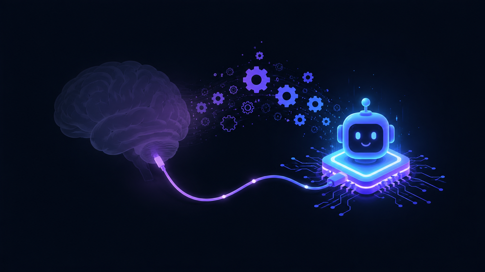
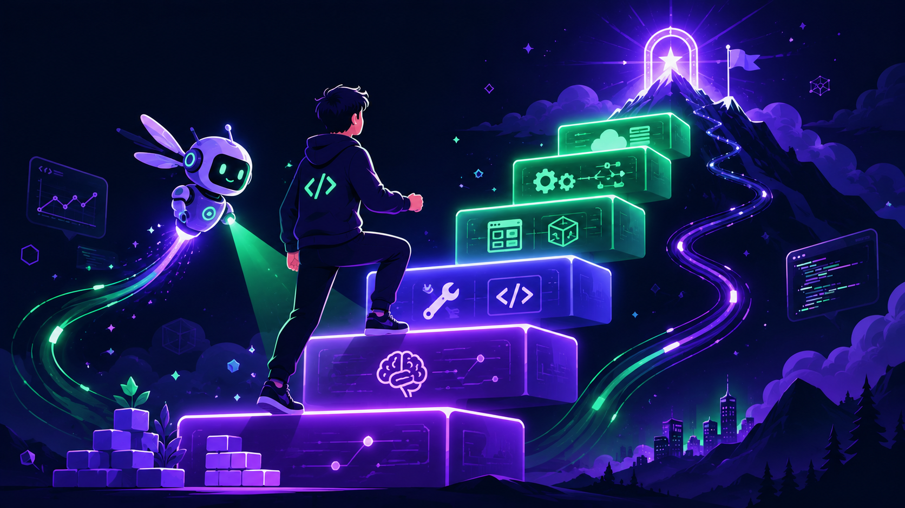

# Sự Bất Lực Tập Nhiễm giữa thời đại AI — Dành cho lập trình viên

> *"AI không làm bạn giỏi hơn hay dở đi. Nó khuếch đại con người bạn đang là."*

Bài viết này lấy cảm hứng từ bài [*"Learned helplessness: Sự bất lực tập nhiễm giữa thời đại AI"* trên Vietcetera](https://vietcetera.com/vn/learned-helplessness-su-bat-luc-tap-nhiem-giua-thoi-dai-ai), nhưng được viết lại và bổ sung dữ liệu nghiên cứu dành riêng cho **lập trình viên** — những người tiếp xúc với AI dày đặc nhất, và cũng dễ rơi vào bẫy "bất lực tập nhiễm" nhất.

Mục tiêu: giúp bạn dùng AI như một **đòn bẩy để học nhanh hơn và làm chủ công nghệ**, thay vì để nó âm thầm bào mòn kỹ năng và sự chủ động của chính bạn.


*Thời đại AI: bạn có thể "nằm im trong lồng" — hoặc bước qua rào để làm chủ.*

---

## Mục lục

- [1. "Sự bất lực tập nhiễm" là gì?](#1-su-bat-luc-tap-nhiem-la-gi)
- [2. Vì sao lập trình viên là nhóm rủi ro cao nhất](#2-vi-sao-lap-trinh-vien-la-nhom-rui-ro-cao-nhat)
- [3. Bằng chứng: AI đang làm gì với não bộ và kỹ năng của bạn](#3-bang-chung-ai-dang-lam-gi-voi-nao-bo-va-ky-nang-cua-ban)
- [4. Ba con đường khiến dev rơi vào bất lực tập nhiễm](#4-ba-con-duong-khien-dev-roi-vao-bat-luc-tap-nhiem)
- [5. Dấu hiệu nhận biết bạn đang "tập nhiễm"](#5-dau-hieu-nhan-biet-ban-dang-tap-nhiem)
- [6. Lật ngược thế cờ: từ ủy thác sang làm chủ](#6-lat-nguoc-the-co-tu-uy-thac-sang-lam-chu)
- [7. Lộ trình học AI liên tục cho dev](#7-lo-trinh-hoc-ai-lien-tuc-cho-dev)
- [8. Kết luận](#8-ket-luan)
- [Nguồn tham khảo](#nguon-tham-khao)

---

## 1. "Sự bất lực tập nhiễm" là gì?

Theo Hiệp hội Tâm lý học Hoa Kỳ (APA), **sự bất lực tập nhiễm (learned helplessness)** xảy ra khi một cá nhân liên tục đối mặt với những tình huống tiêu cực nằm ngoài tầm kiểm soát — đến mức họ **ngừng cố gắng thoát ra, ngay cả khi cơ hội thoát đã ở ngay trước mặt**.【[8](https://www.apa.org/)】

Khái niệm này bắt nguồn từ thí nghiệm năm 1967 của hai nhà tâm lý học **Martin Seligman** và **Steven F. Maier**, thực hiện **trên chó**.【[7](https://en.wikipedia.org/wiki/Learned_helplessness)】 Họ chia chó thí nghiệm thành hai nhóm, cho cả hai nhận các cú sốc điện *giống hệt nhau* — chỉ khác nhau ở một điểm duy nhất: **có kiểm soát được cú sốc hay không**.

```
THÍ NGHIỆM SELIGMAN & MAIER — TRÊN CHÓ (1967)

NHÓM 1 (nhóm "bất lực")        NHÓM 2 (nhóm "kiểm soát")
Chó bị sốc điện, KHÔNG tắt     Chó bị sốc điện, CÓ thể tự
được (dù làm gì cũng vô ích)   tắt (đạp được vào tấm chắn)
        │                              │
        ▼                              ▼
  ┌──────────────────┐         ┌──────────────────┐
  │ Cùng chuyển sang lồng mới có lối thoát dễ dàng │
  │      (rào chắn rất thấp, chỉ cần bước qua)      │
  └──────────────────┘         └──────────────────┘
        │                              │
        ▼                              ▼
  Nằm im chịu trận           Bước/nhảy qua thoát ngay
  KHÔNG cố thoát             "Mình thay đổi được tình huống"
  = BẤT LỰC TẬP NHIỄM        = giữ được sự chủ động
```

Điểm mấu chốt: hai nhóm chó nhận **lượng sốc như nhau** — thứ tạo ra khác biệt không phải nỗi đau, mà là **trải nghiệm "mình có kiểm soát được hay không"**.

Phát hiện cốt lõi: **bộ não cần trải nghiệm thực tế về việc "mình kiểm soát được" thì mới học được sự chủ động.** Khi bị tước đi cảm giác kiểm soát đủ lâu, mặc định nó chuyển sang trạng thái thụ động — *"có cố cũng vô ích"*.

Điều đáng sợ: bất lực tập nhiễm **không cần một cú sốc lớn**. Nó hình thành dần dần, qua hàng trăm quyết định nhỏ mỗi ngày khi ta chọn "buông tay" thay vì "thử thêm một lần nữa".

---

## 2. Vì sao lập trình viên là nhóm rủi ro cao nhất

Nghề lập trình bản chất là **giải quyết vấn đề liên tục**: đọc lỗi, lần theo stack trace, hình thành giả thuyết, thử nghiệm, sửa. Mỗi vòng lặp ấy chính là một lần não bộ *"tập kiểm soát"* — đúng thứ mà thí nghiệm Seligman nói là điều kiện sống còn để không rơi vào bất lực.

AI coding assistant (ChatGPT, Claude, Copilot, Cursor...) đi thẳng vào trung tâm của vòng lặp này. Thay vì tự vật lộn với một bug trong 20 phút, bạn dán nó vào chat và có câu trả lời trong 20 giây. Tiện lợi tuyệt vời — nhưng cũng là nơi **"ủy thác nhận thức" (cognitive offloading)** diễn ra: ta giao phần *suy nghĩ* cho máy, và giữ lại phần *copy-paste*.

> **Ủy thác nhận thức** không xấu. Con người vẫn luôn làm vậy — máy tính bỏ túi, GPS, Google. Vấn đề là **ủy thác cái gì**. Ủy thác phép tính nhân thì ổn. Ủy thác *khả năng tư duy và lần ra vấn đề* thì nguy hiểm, vì đó chính là năng lực lõi của nghề.


*Ủy thác nhận thức: ta giao phần "suy nghĩ" cho máy, giữ lại phần "copy-paste".*

Mức độ phơi nhiễm của dev cao hơn hẳn nghề khác:

- **Tần suất:** Theo khảo sát, **67% dev dùng Copilot từ 5 ngày/tuần trở lên** — gần như mọi tác vụ đều có AI tham gia.【[3](https://medium.com/@reliabledataengineering/ai-is-writing-46-of-all-code-github-copilots-real-impact-on-15-million-developers-787d789fcfdc)】
- **Mức độ phổ cập:** Báo cáo **DORA 2025** ghi nhận **90% dev đã dùng AI trong công việc**.【[6](https://cloud.google.com/blog/products/ai-machine-learning/announcing-the-2025-dora-report)】
- **Tính tức thời của phản hồi:** AI luôn trả lời, không phán xét, không "đóng câu hỏi vì trùng lặp" như Stack Overflow — nên rào cản để "buông tay và hỏi AI" gần như bằng 0.

Càng tiện, ta càng ít có cơ hội tự trải nghiệm cảm giác *"tôi tự giải được"*. Và đó chính là nguyên liệu của bất lực tập nhiễm phiên bản kỹ thuật số.

---

## 3. Bằng chứng: AI đang làm gì với não bộ và kỹ năng của bạn

Đây không phải lo lắng cảm tính. Một loạt nghiên cứu 2025 đã đo được hiện tượng này.

### 3.1. MIT — "Your Brain on ChatGPT"

Nhóm nghiên cứu của MIT Media Lab (dẫn đầu bởi Nataliya Kos'myna) chia người tham gia làm 3 nhóm viết luận: **chỉ dùng não (Brain-only)**, **dùng search engine**, và **dùng LLM**. Họ đo hoạt động não bằng EEG.【[1](https://www.media.mit.edu/projects/your-brain-on-chatgpt/overview/)】

Kết quả:

| Nhóm | Mức kết nối thần kinh (EEG) | Khả năng nhớ lại bài vừa viết |
|------|----------------------------|-------------------------------|
| Brain-only | Mạnh nhất, phân bố rộng nhất | Cao |
| Search engine | Trung bình | Trung bình |
| LLM (ChatGPT) | **Yếu nhất** | **83% không trích lại nổi 1 câu** |

Có tới **83% người dùng ChatGPT không thể trích lại dù chỉ một câu** trong bài luận họ *vừa* viết xong.【[1](https://www.media.mit.edu/projects/your-brain-on-chatgpt/overview/)】 Nhóm tác giả gọi hiện tượng này là **"cognitive debt"** (nợ nhận thức) — bạn xong việc, nhưng não không lưu lại gì.

> ⚠️ Nghiên cứu này là bản preprint (tháng 6/2025), chưa qua peer-review — nên đọc với thái độ thận trọng. Nhưng tín hiệu thì rõ: **outsource việc tư duy → giảm engagement của não → kiến thức không đọng lại.**

### 3.2. Microsoft & Carnegie Mellon (CHI 2025) — Nghịch lý của sự tự tin

Khảo sát **319 người làm tri thức (knowledge workers)** với 936 tình huống dùng AI thực tế. Hai phát hiện đắt giá:【[2](https://dl.acm.org/doi/full/10.1145/3706598.3713778)】

- **Càng tin AI → càng ít tư duy phản biện.** Niềm tin cao vào AI tỉ lệ nghịch với mức độ kiểm chứng.
- **Càng tự tin vào năng lực của chính mình → càng tư duy phản biện nhiều hơn** (dù tốn sức hơn).

Hệ quả: AI có xu hướng làm **co hẹp vai trò của con người** — từ *"người tạo ra giải pháp"* thành *"người duyệt và sửa lỗi giải pháp của máy"*. Khi điều đó kéo dài, kỹ năng tạo giải pháp teo dần.

### 3.3. METR — AI có thể làm bạn *chậm* hơn (mà bạn không nhận ra)

Thử nghiệm RCT của METR (2025) trên **16 dev open-source giàu kinh nghiệm** (trung bình 5 năm trên chính codebase đó), 246 tác vụ chia ngẫu nhiên cho phép/không cho phép dùng AI.【[4](https://arxiv.org/abs/2507.09089)】

```
KỲ VỌNG vs THỰC TẾ (METR 2025)

Trước khi làm, dev dự đoán AI giúp NHANH hơn   →  −24% thời gian
Sau khi làm xong, dev vẫn tin AI giúp nhanh hơn →  −20% thời gian
                                                    ────────────
ĐO ĐẠC THỰC TẾ                                  →  +19% thời gian (CHẬM hơn!)
```

Dev tin chắc AI giúp họ nhanh hơn ~20%, nhưng số liệu cho thấy **họ chậm đi 19%** — phần lớn thời gian "mất" vào việc kiểm tra, sửa lại output thiếu tin cậy của AI. Khoảng cách giữa *cảm giác* và *thực tế* chính là nơi automation bias trú ngụ.

> Lưu ý: kết quả này áp dụng cho **expert làm trên codebase quen thuộc**. Với task mới, ngôn ngữ lạ, boilerplate — AI thường giúp thật. Bài học không phải "AI vô dụng", mà là **"đừng tin cảm giác, hãy đo".**

### 3.4. Stack Overflow sụp đổ — hệ sinh thái học tập đang biến mất

Số câu hỏi mới trên Stack Overflow **giảm ~76% kể từ khi ChatGPT ra mắt (11/2022)**; tính riêng tháng 4/2025 đã **giảm 64% so với cùng kỳ 2024 và hơn 90% so với đỉnh 2020**.【[5](https://www.allstacks.com/blog/ai-killed-the-stack-overflow-star-the-76-collapse-in-developer-qa)】

Vì sao đáng lo? Stack Overflow không chỉ là nơi tra cứu — nó là nơi **tư duy được công khai**: câu hỏi sai bị mổ xẻ, nhiều cách giải được tranh luận, kèm cảnh báo cạm bẫy. Khi dev chuyển sang hỏi AI riêng tư, ta mất đi tầng *học từ va chạm cộng đồng* đó. Tệ hơn: chính các LLM tương lai cũng cạn dần dữ liệu chất lượng do con người tạo ra.

### 3.5. DORA 2025 — AI là "đòn bẩy", không phải "thuốc tiên"

Báo cáo DORA 2025 đưa ra kết luận cân bằng nhất: **AI là một bộ khuếch đại (amplifier)**.【[6](https://cloud.google.com/blog/products/ai-machine-learning/announcing-the-2025-dora-report)】

- Hơn **80% dev tin AI tăng năng suất của họ** — và 2025 đã có bằng chứng AI tác động tích cực lên throughput.
- Nhưng **30% dev gần như không tin tưởng vào code do AI sinh ra** ("trust paradox").
- "AI không sửa được một team yếu — nó **phóng đại** thứ vốn có. Team mạnh dùng AI để mạnh hơn; team yếu thấy vấn đề của mình bị khuếch đại."

Thông điệp cho cá nhân cũng vậy: **AI khuếch đại nền tảng của bạn.** Nền tảng vững → AI biến bạn thành 10x. Nền tảng rỗng → AI giúp bạn tạo ra sai lầm nhanh gấp 10 lần.

---

## 4. Ba con đường khiến dev rơi vào bất lực tập nhiễm

Bài Vietcetera chỉ ra 3 nguyên nhân chung. Dưới đây là phiên bản đã "dịch" sang bối cảnh lập trình viên.

### 4.1. Áp lực tiến độ → não chọn đường tắt mặc định
Lịch deadline dày đặc làm cạn "dung lượng tư duy". Khi não đã mệt, nó tự động chọn giải pháp nhanh nhất: paste lỗi vào AI, lấy code, chạy được là xong — không cần hiểu *vì sao* nó chạy được. Lặp đủ nhiều, "không cần hiểu" trở thành thói quen.

### 4.2. Mặc cảm tự ti → "thôi để AI làm cho rồi"
Khoảng cách giữa tốc độ của máy và của người ngày càng lộ rõ. Cảm giác *"mình gõ cả buổi không bằng nó gõ 5 giây"* dễ dẫn đến cam chịu, từ bỏ quyền can thiệp. Đây đúng là cơ chế của con chó trong lồng: *"có cố cũng chẳng bằng nó, thôi đừng cố nữa."*

### 4.3. Thiết kế thao túng → sycophancy & automation bias
- **Nịnh bợ (sycophancy):** Chatbot được tối ưu để làm hài lòng, hay khẳng định *"Ý bạn rất hay!"* kể cả khi bạn sai — vuốt ve cái tôi và làm bạn ngừng nghi ngờ.
- **Automation bias:** Xu hướng tin output tự động và bỏ qua thông tin mâu thuẫn. Khi AI "luôn đúng" 95% lần, ta mất cảnh giác đúng vào 5% lần nó sai — và đó thường là lúc trả giá đắt nhất.【[9](https://thedecisionlab.com/biases/automation-bias)】

---

## 5. Dấu hiệu nhận biết bạn đang "tập nhiễm"

Tự kiểm tra trung thực. Càng nhiều dấu hiệu, càng cần hành động:

- [ ] Gặp lỗi → phản xạ đầu tiên là **paste cho AI**, không phải đọc message.
- [ ] **Không nhớ nổi** code mình "viết" tuần trước hoạt động thế nào (triệu chứng *cognitive debt*).
- [ ] Khi AI/Copilot **không khả dụng**, năng suất tụt thẳng đứng, thấy "mất tay lái".
- [ ] **Merge code AI mà không thật sự đọc** — tin là nó đúng vì "trông hợp lý".
- [ ] Lâu rồi **không học một khái niệm nền tảng mới** nào ngoài việc hỏi AI giải thích nhanh.
- [ ] Phỏng vấn / whiteboard không có gợi ý → **đơ**, dù task đơn giản (có report về junior không viết nổi FizzBuzz khi không có autocomplete).【[3](https://medium.com/@tarxemo/github-copilot-made-me-a-worse-developer-57906a16f1f9)】

> **Quy tắc tự chẩn:** Nếu việc đầu tiên khi gặp khó là *"hỏi AI"* thay vì *"thử nghĩ 5 phút"* — bạn đang huấn luyện não bỏ cuộc sớm.

---

## 6. Lật ngược thế cờ: từ ủy thác sang làm chủ

Tin tốt: bất lực tập nhiễm **có thể đảo ngược**. Seligman gọi cách chữa là *"learned optimism"* — học lại cảm giác mình kiểm soát được. Dưới đây là phiên bản hành động cho dev, kết hợp lời khuyên gốc với thực hành kỹ thuật.

### 6.1. Biến bức tường thành đối thoại (Seligman → dev)
Thay vì buông *"AI ơi sửa giúp"*, hãy hỏi AI theo hướng **kích hoạt tư duy của bạn**:
- *"Giải thích **nguyên nhân gốc** của lỗi này, đừng đưa code vội."*
- *"Cho tôi **3 hướng tiếp cận** và trade-off của từng cái."*
- *"Hỏi ngược lại tôi để chắc tôi đã hiểu vấn đề trước khi sửa."*

Mục tiêu: dùng AI như một **bạn học/mentor giỏi**, không phải máy bán hàng tự động trả ra đáp án.

### 6.2. "Brain-first" — thử trước, hỏi sau
Đặt một **rào cản cố ý** trước khi gọi AI:
- Quy tắc **"5 phút brain-only"**: với mọi bug, tự hình thành giả thuyết trong 5 phút trước khi mở chat.
- Tự viết giải pháp nháp → *sau đó* nhờ AI review. Bạn vẫn giữ vai trò "người tạo giải pháp" (đúng thứ nghiên cứu Microsoft nói giúp giữ tư duy phản biện).

### 6.3. Thách thức cái máy — không bao giờ merge mù
- Bắt AI **giải thích từng bước** suy luận; chủ động đi tìm **lỗ hổng logic** trong output.
- Áp dụng tư duy review: *"Đoạn này sai trong trường hợp nào? Edge case nào chưa xử lý? Có lỗ hổng bảo mật không?"*
- Nhớ METR: **cảm giác nhanh ≠ thực sự nhanh**. Với task quan trọng, thà chậm mà hiểu.

### 6.4. Tách bạch: học hay sản xuất?
Phân biệt hai chế độ làm việc:

| Chế độ | Mục tiêu | Cách dùng AI |
|--------|----------|--------------|
| **Sản xuất (ship)** | Ra việc nhanh | Tận dụng AI tối đa: boilerplate, refactor, test scaffold |
| **Học (learn)** | Tăng năng lực lõi | AI ở vai trò mentor/đặt câu hỏi — *bạn* tự code phần khó |

Sai lầm chí mạng là dùng chế độ "ship" cho **mọi thứ**, kể cả lúc lẽ ra phải đang học. Hãy chủ động dành thời gian cho chế độ "học".

### 6.5. Neo giữ tâm trí vào thực tại
Đúng như bài gốc: duy trì **deliberate practice** (luyện tập có chủ đích) — làm side project không AI, đọc source code thư viện, giải thuật toán bằng tay, dạy lại người khác. Đây là "phòng gym" giữ cho cơ bắp tư duy không teo.

---

## 7. Lộ trình học AI liên tục cho dev

Làm chủ thời đại AI **không** có nghĩa là tránh AI — mà là **liên tục nâng cấp bản thân nhanh hơn tốc độ AI thay đổi**. Đây là lộ trình thực dụng:


*Làm chủ AI = liên tục leo lên tầng năng lực cao hơn, với AI soi đường.*

```
TẦNG 1 — NỀN TẢNG (không bao giờ outsource)
   • CS fundamentals: data structures, complexity, networking, OS
   • Đọc-hiểu code & debug bằng tay
   • Tư duy hệ thống & thiết kế
        │  (AI khuếch đại tầng này → giữ cho nó vững)
        ▼
TẦNG 2 — KỸ NĂNG LÀM VIỆC VỚI AI (kỹ năng mới của nghề)
   • Prompt engineering & context engineering
   • Đánh giá / verify output, phát hiện hallucination
   • Biết khi nào KHÔNG nên dùng AI
        │
        ▼
TẦNG 3 — XÂY DỰNG VỚI AI (lợi thế cạnh tranh)
   • LLM API, function calling, tool use
   • RAG, embeddings, vector search
   • AI agents, MCP, orchestration
        │
        ▼
TẦNG 4 — HỆ THỐNG (10x thật sự)
   • Đưa AI vào sản phẩm production an toàn
   • Eval, observability, cost & latency
   • Tự động hoá workflow team
```

**Thói quen học bền vững:**
- **Học để hiểu, không học để nhớ đáp án:** mỗi lần AI giải xong, hỏi *"vì sao"* cho đến khi bạn tự giải thích lại được.
- **Build > đọc:** kiến thức AI thay đổi quá nhanh, làm một dự án nhỏ thật (RAG, agent, MCP server) dạy nhiều hơn 10 bài blog.
- **Theo nguồn gốc:** ưu tiên tài liệu chính thức và paper hơn tóm tắt tầng 3.
- **Dạy lại:** viết blog, chia sẻ team — "dạy lại" là bài test trung thực nhất xem bạn có thực sự hiểu hay chỉ copy.
- **Đo, đừng đoán:** định kỳ tự kiểm tra — *không có AI, mình còn làm được không?*

> AI sẽ thay thế những dev *dùng AI để khỏi phải suy nghĩ*. Nó sẽ khuếch đại những dev *dùng AI để suy nghĩ ở tầm cao hơn*. Khoảng cách giữa hai nhóm này đang giãn ra mỗi ngày.

---

## 8. Kết luận

Con chó trong thí nghiệm Seligman không nhảy ra khỏi lồng không phải vì rào quá cao — mà vì **nó đã học rằng cố gắng là vô ích**. Bất lực tập nhiễm phiên bản dev cũng vậy: không phải bạn *không thể* tự giải, mà là bạn đã *quen* với việc không cần tự giải.

Bí quyết phát triển trong thời đại AI không phải là dùng AI ít đi, cũng không phải dùng nhiều hơn — mà là **giữ vững quyền tự chủ tư duy** trong khi để AI lo phần lao động lặp lại. Hãy để AI giải phóng thời gian, rồi **đầu tư thời gian đó vào việc học những thứ AI chưa thay được**.

Làm chủ công nghệ không phải đích đến, mà là một **thói quen học hỏi không ngừng**. Người làm chủ thời đại AI là người không bao giờ ngừng hỏi *"vì sao"* — kể cả khi máy đã đưa sẵn câu trả lời.

---

## Nguồn tham khảo

[1] MIT Media Lab — *Your Brain on ChatGPT: Accumulation of Cognitive Debt when Using an AI Assistant for Essay Writing Task* — https://www.media.mit.edu/projects/your-brain-on-chatgpt/overview/
[2] Microsoft & Carnegie Mellon (CHI 2025) — *The Impact of Generative AI on Critical Thinking* — https://dl.acm.org/doi/full/10.1145/3706598.3713778
[3] GitHub Copilot's Real Impact / over-reliance & deskilling — https://medium.com/@reliabledataengineering/ai-is-writing-46-of-all-code-github-copilots-real-impact-on-15-million-developers-787d789fcfdc
[4] METR (2025) — *Measuring the Impact of Early-2025 AI on Experienced Open-Source Developer Productivity* — https://arxiv.org/abs/2507.09089
[5] Allstacks — *AI Killed the Stack Overflow Star: The 76% Collapse in Developer Q&A* — https://www.allstacks.com/blog/ai-killed-the-stack-overflow-star-the-76-collapse-in-developer-qa
[6] Google Cloud / DORA — *Announcing the 2025 DORA Report* — https://cloud.google.com/blog/products/ai-machine-learning/announcing-the-2025-dora-report
[7] Wikipedia — *Learned helplessness* (Seligman & Maier, 1967) — https://en.wikipedia.org/wiki/Learned_helplessness
[8] American Psychological Association — *APA Dictionary of Psychology: learned helplessness* — https://www.apa.org/
[9] The Decision Lab — *Automation Bias* — https://thedecisionlab.com/biases/automation-bias
[10] Vietcetera — *Learned helplessness: Sự bất lực tập nhiễm giữa thời đại AI* (bài gốc) — https://vietcetera.com/vn/learned-helplessness-su-bat-luc-tap-nhiem-giua-thoi-dai-ai

---

*Tổng hợp & biên soạn bởi **Hưng 2x** · Tháng 6/2026*
