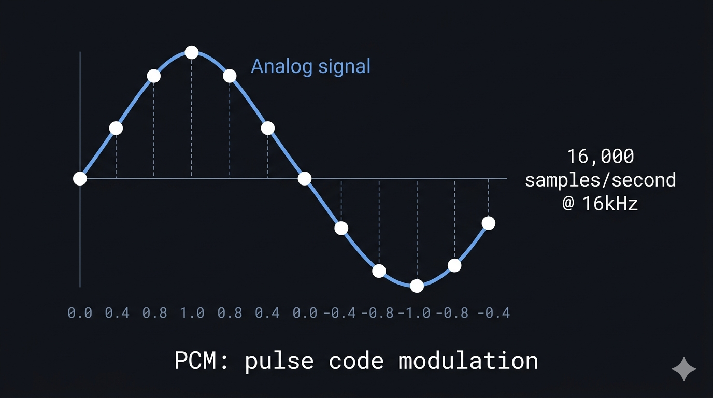

# Bài 01 — Audio Fundamentals cho Voice AI

> **Tầng 1 — Nền tảng** | Series: [Voice AI System Architecture](./README.md)
> ⏱ ~10 phút đọc · 💡 Sau bài này: hiểu tại sao Voice AI phone channel phức tạp hơn browser, và tại sao mỗi bước trong pipeline đều có "giá" latency

---

Tại sao giọng AI khi gọi điện thoại luôn nghe "mỏng" và khác hẳn khi dùng web app — dù cùng một model?

Câu trả lời không phải ở model. Không phải ở prompt. Mà ở một con số: **8.000**.

Đó là số lần mỗi giây mà hệ thống điện thoại "chụp ảnh" âm thanh giọng nói — một chuẩn được đặt ra từ năm 1972 và vẫn chưa thay đổi. Web app dùng 48.000 lần/giây. Sự khác biệt đó — 8kHz vs 48kHz — là nguồn gốc của toàn bộ bài toán Audio Bridge mà bài 04 sẽ đi sâu.

Nhưng trước tiên: audio số là gì, và tại sao con số sample rate lại quan trọng đến vậy?

---

## Âm thanh số — từ sóng vật lý đến dãy số

Âm thanh trong tự nhiên là sóng áp suất không khí — liên tục, analog. Máy tính không thể lưu sóng liên tục, nên phải "chụp ảnh" sóng đó nhiều lần mỗi giây, mỗi lần ghi lại một con số đại diện cho biên độ (amplitude) tại thời điểm đó. Quá trình này gọi là **sampling** (lấy mẫu), và dãy số thu được chính là **audio số** (digital audio).



Hai thông số quyết định chất lượng audio số:

**Sample rate** (tần số lấy mẫu) — bao nhiêu lần "chụp" mỗi giây, đo bằng Hz hoặc kHz. Theo định lý Nyquist, sample rate phải gấp đôi tần số cao nhất muốn tái tạo. Tai người nghe được đến ~20kHz nên CD dùng 44.1kHz. Nhưng giọng nói chỉ nằm trong khoảng 300Hz–3.4kHz (điện thoại) hoặc đến ~8kHz (wideband) — không cần sample rate cao như nhạc.

**Bit depth** (độ sâu bit) — mỗi lần chụp, dùng bao nhiêu bit để ghi con số biên độ. 8-bit cho 256 mức, 16-bit cho 65.536 mức. Bit depth cao hơn = chi tiết hơn = ít nhiễu lượng tử hóa hơn (quantization noise). Voice AI thường dùng 16-bit — đủ chi tiết cho giọng nói mà không quá nặng.

Kết hợp hai thông số này tạo ra **PCM** — khái niệm nền tảng nhất trong toàn bộ series.

---

## PCM — "ngôn ngữ chung" của Voice AI pipeline

**PCM (Pulse Code Modulation)** là cách biểu diễn audio số đơn giản nhất: một dãy số tuần tự, mỗi số là biên độ tại một thời điểm, không nén, không biến đổi. Mọi codec audio cuối cùng đều phải decode về PCM trước khi xử lý hoặc phát.

PCM quan trọng trong Voice AI vì đây là ngôn ngữ mà AI model "hiểu": model nhận **PCM 16kHz** đầu vào và xuất **PCM 24kHz** đầu ra. G.711 từ điện thoại phải decode về PCM. Opus từ browser phải decode về PCM. Sau đó encode ngược lại để gửi đi.

**PCM nặng như thế nào?**
1 giây audio PCM 16kHz, 16-bit = 16.000 samples × 2 bytes = **32KB**.
Một cuộc gọi 5 phút = **~9.6MB** chỉ riêng audio thô — chưa kể metadata hay protocol overhead.

Đây là lý do cần codec để truyền qua mạng. Nhưng mọi codec đều phải "về PCM" trước khi AI xử lý — và đó chính là nơi latency tích lũy.

> ⚠️ **Misconception phổ biến:** *"Dùng PCM 48kHz cho AI model cho chất lượng cao hơn."* — Thực ra model chỉ cần 16kHz đầu vào. Nếu feed 48kHz, model tự downsample — bạn vừa tốn bandwidth, vừa tốn CPU, mà không được gì thêm.

---

## 4 sample rate cần thuộc lòng

Đây là phần nhiều người bị lẫn lộn nhất — vì mỗi thành phần trong pipeline dùng một con số khác nhau và đều có lý do kỹ thuật cụ thể.

| Sample rate | Dùng ở đâu | Codec | Tần số tái tạo | Ghi chú |
|------------|-----------|-------|---------------|--------|
| **8kHz** | PSTN / Điện thoại | G.711 µ-law | 0–4kHz | Chuẩn từ 1972, không thay đổi |
| **16kHz** | AI model input | PCM 16-bit | 0–8kHz | Chuẩn hầu hết STT/voice model |
| **24kHz** | AI model output | PCM 16-bit | 0–12kHz | Chuẩn TTS hiện đại, giọng tự nhiên |
| **48kHz** | Browser/WebRTC | Opus | 0–24kHz | Chất lượng cao nhất trong pipeline |

**Luồng chuyển đổi khi phone gọi vào hệ thống:**

```
Phone      Upsample     AI Input     AI Output    Downsample     Phone
8kHz    →  8→16kHz   →  16kHz     →  24kHz     →  24→8kHz     →  8kHz
G.711      (+PCM)       PCM          PCM          (+G.711)       G.711
```

Chính sự không khớp giữa 4 con số này — đặc biệt là 8kHz của phone vs 16/24kHz của AI — là toàn bộ lý do tồn tại của Audio Bridge. Sẽ đi sâu ở [Bài 04](./04-audio-bridge.md).

---

## G.711 — codec sinh ra từ năm 1972 vẫn đang chạy hôm nay

**G.711** là codec audio tiêu chuẩn của mạng điện thoại toàn cầu (PSTN), được ITU chuẩn hóa năm 1972. Nghe có vẻ cổ xưa — nhưng đây là codec mà *mọi cuộc gọi điện thoại trên thế giới* vẫn đang sử dụng, kể cả cuộc gọi qua Twilio hay Telnyx vào hệ thống Voice AI của bạn.

**Tại sao G.711 vẫn tồn tại?** Vì có hàng tỷ thiết bị và hàng triệu km cáp viễn thông được thiết kế xung quanh chuẩn này. Thay thế G.711 nghĩa là thay thế toàn bộ hạ tầng viễn thông toàn cầu — điều không ai làm. Đây là ví dụ điển hình của "legacy lock-in" quy mô hành tinh.

G.711 dùng kỹ thuật **companding** (nén-giãn) — thay vì ghi biên độ tuyến tính (linear PCM), nó dùng thang logarithmic. Âm thanh nhỏ được ghi với độ phân giải cao hơn, âm thanh lớn bị nén lại. Điều này tận dụng đặc tính tai người: nhạy hơn với thay đổi ở âm lượng nhỏ hơn là ở âm lượng lớn.

Có 2 biến thể: **µ-law** (Bắc Mỹ, Nhật) và **A-law** (châu Âu, phần còn lại). Cả hai đều nén 14-bit linear PCM xuống 8-bit logarithmic → bitrate cố định **64kbps**.

**Hệ quả cho Voice AI:** Khi user gọi qua số điện thoại thật, audio đến server ở dạng G.711 µ-law 8kHz, 8-bit. Server phải:

```
G.711 µ-law → Decode → Linear PCM 8kHz → Upsample → PCM 16kHz → AI Model
AI Model PCM 24kHz → Downsample → PCM 8kHz → Encode G.711 → Điện thoại
```

**Mỗi bước chuyển đổi đều có giá — latency tăng và chất lượng có thể giảm nếu làm sai.**

---

## Opus — codec được thiết kế cho internet

**Opus** là codec audio hiện đại, chuẩn mở (RFC 6716, 2012), được thiết kế đặc biệt cho truyền thông realtime qua internet. Đây là codec mặc định của WebRTC — nghĩa là khi user dùng browser để nói chuyện với AI, audio được encode bằng Opus.

Opus kết hợp 2 công nghệ: **SILK** (phát triển bởi Skype, tối ưu cho giọng nói) và **CELT** (tối ưu cho âm nhạc/âm thanh tổng quát). Nó tự động chuyển đổi giữa 2 mode tùy nội dung.

| Thông số | G.711 µ-law | Opus (RFC 6716) |
|----------|------------|----------------|
| Ra đời | 1972 | 2012 |
| Dùng cho | PSTN / Phone | WebRTC / Browser |
| Sample rate | 8kHz | 8–48kHz |
| Bitrate | 64kbps cố định | 6–510kbps adaptive |
| Nén | Logarithmic (µ-law) | SILK + CELT hybrid |
| Chống mất gói | Không | FEC tích hợp |
| Algorithmic delay | ~0ms | 2.5–20ms |

**Tại sao Opus quan trọng trong Voice AI:** channel browser (WebRTC) dùng Opus 48kHz, cho chất lượng audio cao nhất có thể. Khi server nhận audio từ browser, nó cần decode Opus → PCM → có thể resample về 16kHz cho model. Nhưng vì Opus qua WebRTC thường được thiết lập direct connection (browser ↔ AI model), server có thể không cần chạm vào audio — đây là khác biệt kiến trúc cơ bản giữa channel browser và phone.

---

## Tại sao tất cả điều này quan trọng cho Voice AI

Có một engineer đã deploy Voice AI lên production. Tiếng nghe méo, AI nhận diện sai tên người dùng. Anh đổi model 3 lần. Thêm noise cancellation. Tinh chỉnh prompt. Vẫn méo.

Nguyên nhân thật: code audio bridge upsample 8kHz → 16kHz dùng **nearest-neighbor interpolation** thay vì **sinc interpolation** — sai về mặt tín hiệu số, tạo ra aliasing artifact. Không biết sample rate và cách resampling hoạt động, không bao giờ tìm ra lỗi này. Model không giúp gì được.

Audio fundamentals là nền tảng để tránh class of bugs này:

- Không hiểu **sample rate** → không hiểu tại sao cần upsample/downsample, không biết chọn algorithm nào
- Không hiểu **G.711** → không hiểu tại sao channel phone phức tạp hơn browser
- Không hiểu **PCM** → không hiểu "ngôn ngữ chung" giữa các thành phần
- Không hiểu **codec overhead** → không debug được latency budget — mỗi bước encode/decode đều tốn thời gian

---

## Tóm tắt — những gì cần nhớ

**PCM** là "ngôn ngữ chung" — mọi audio trong pipeline đều phải decode về PCM trước khi AI xử lý. Mọi bước encode/decode đều có giá latency.

**4 sample rate:** 8kHz (phone) → 16kHz (AI input) → 24kHz (AI output) → 48kHz (browser). Sự không khớp giữa chúng là toàn bộ lý do tồn tại của Audio Bridge.

**G.711 là thực tế không thể thay đổi** — hạ tầng viễn thông toàn cầu sẽ không upgrade trong tương lai gần. Hệ thống Voice AI production phải nói được "ngôn ngữ 1972" này.

**Opus và G.711 đại diện cho 2 thế giới** — internet adaptive vs PSTN fixed. Voice AI production phải bridge cả hai.

---

## Bài tiếp theo

Bài 01 giải thích *cái gì* đang được truyền — dãy số PCM, đóng gói bởi G.711 hoặc Opus.

**Bài 02 — WebSocket & Realtime Communication** giải thích *truyền bằng cách nào*. Cụ thể: tại sao HTTP request/response không dùng được cho audio streaming, WebSocket lifecycle hoạt động ra sao, và 2 pattern kiến trúc khác nhau giữa Browser channel và Phone channel.

→ [Đọc Bài 02 ngay](./02-websocket-realtime-communication.md)

---

*Bài 1/15 · ← [Tổng quan](./00-overview.md) · [Roadmap](./README.md) → [WebSocket & Realtime](./02-websocket-realtime-communication.md)*
