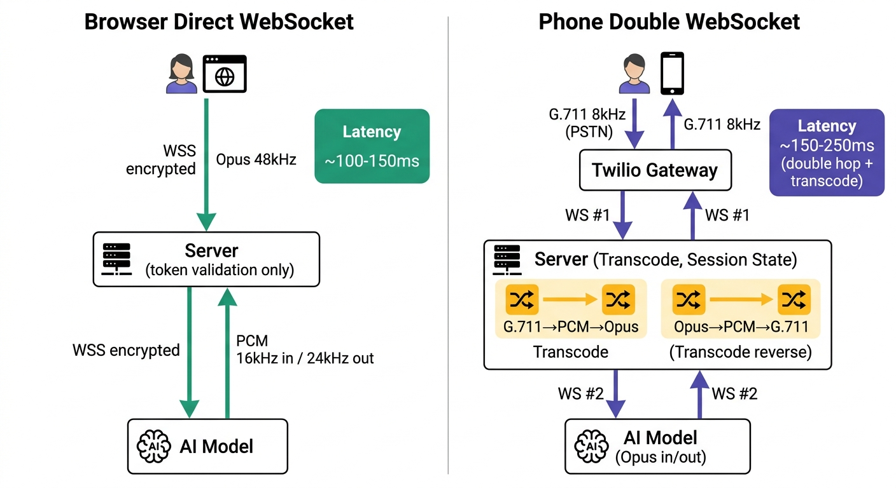

# Bài 02 — WebSocket & Realtime Communication

> **Tầng 1 — Nền tảng** | Series: [Voice AI System Architecture](./README.md)
> ⏱ ~10 phút đọc · 💡 Sau bài này: hiểu tại sao Voice AI không thể dùng HTTP thông thường, và cách WebSocket hỗ trợ streaming hai chiều realtime

---

## 🚨 Từ Demo Thành Production — Một Câu Chuyện Thực

Năm 2024, một startup AI healthcare demo thành công trên môi trường nội bộ. **Cuộc demo hoàn hảo:** Voice receptionist trả lời trong 280ms, giọng tự nhiên, context-aware. Investors thích thú.

Ba tuần sau, startup **deploy lên production qua Twilio** (kết nối điện thoại thực).

- **Cuộc gọi #1–10:** Hoàn hảo.
- **Cuộc gọi #11:** Bị hang 2 giây, user cúp máy.
- **Cuộc gọi #50:** Timeout, "All agents busy" error.
- **Cuộc gọi #100+:** Dropout rate 40%, support tickets tăng vọt.

**Đội engineering đổ lỗi cho model:** "GPT-4o chưa đủ tốt," "Prompt sai," "Cần fine-tune."

**Sai.** Model là 20% của problem. **80% là kiến trúc** — cụ thể: **cách truyền audio giữa client và server**.

Demo dùng HTTP POST requests. Production không chịu được. **Đây là lý do bạn cần hiểu WebSocket.**

---

## Bài toán cốt lõi — Tại sao Voice AI không thể dùng HTTP?

**HTTP hoạt động theo mô hình request-response:** Client gửi request → Server xử lý → Server trả response → Kết nối đóng.

Giống như gửi thư — mỗi lần muốn hỏi gì, bạn viết thư mới, gửi đi, chờ hồi âm.

### Vấn đề với Voice AI

Cuộc hội thoại voice là **liên tục và hai chiều đồng thời**:

- Audio là dòng dữ liệu liên tục — cứ mỗi 20ms lại có một chunk audio mới
- Cần truyền **50 chunks mỗi giây, hai chiều cùng lúc**
- Cả hai bên đều có thể "nói" bất cứ lúc nào (barge-in)

Với HTTP, mỗi chunk cần một request riêng kèm:

- Header overhead: ~200–500 bytes (so với payload chỉ 320 bytes)
- Phải chờ response trước khi gửi chunk tiếp theo
- Không có cơ chế server chủ động push audio xuống

**Kết quả:** Overhead lên đến **50–150%** với HTTP. Trong khi latency budget của Voice AI chỉ có 300ms, protocol overhead đã nuốt hết budget trước khi AI kịp xử lý.

---

## Những nỗ lực "hack" HTTP để realtime

Trước khi WebSocket ra đời (2011), developer đã cố gắng giả lập realtime trên HTTP:

### Polling
Client gửi request liên tục theo chu kỳ (ví dụ mỗi 100ms) để hỏi "có dữ liệu mới không?"

**Vấn đề:** Đa số request trả về rỗng, tốn băng thông. Không đủ nhanh cho audio realtime.

### Long Polling
Client gửi request, server giữ connection mở đến khi có dữ liệu rồi mới trả response.

**Vấn đề:** Vẫn một chiều. Có khoảng "chết" giữa các response khi client phải gửi lại request mới.

### Server-Sent Events (SSE)
Server push dữ liệu liên tục xuống client qua HTTP connection mở.

**Vấn đề:** Chỉ một chiều (server → client). Client gửi ngược lại phải mở request riêng. Không phù hợp cho audio hai chiều đồng thời.

---

## WebSocket — Giải pháp được thiết kế cho realtime

**WebSocket (RFC 6455, 2011)** là giao thức **hai chiều, full-duplex, persistent** trên một TCP connection duy nhất.

Cả client lẫn server đều có thể gửi dữ liệu bất cứ lúc nào, không cần chờ request/response cycle.

### Cách WebSocket hoạt động

```
Client                           Server
  │──── HTTP GET /ws ────────────→│
  │     Upgrade: websocket        │
  │←─── 101 Switching Protocols  ─│
  │                               │
  │══════════ WebSocket ══════════│
  │←── audio frame ───────────────│  ← Server gửi bất cứ lúc nào
  │──── audio frame ─────────────→│  ← Client gửi bất cứ lúc nào
  │←── audio frame ───────────────│  ← Đồng thời, không chờ nhau
  │──── audio frame ─────────────→│
  │            ...                │
```

1. **Opening Handshake** — HTTP Upgrade request với header `Upgrade: websocket`
2. **Server đồng ý** — Response 101 (Switching Protocols)
3. **Kết nối thiết lập** — Connection TCP không còn nói HTTP nữa
4. **Two-way streaming** — Cả hai bên gửi nhận frames liên tục suốt cuộc gọi

### Frame overhead: 2–14 bytes vs 200–500 bytes

Sau handshake, mỗi WebSocket frame chỉ tốn **2–14 bytes header** (phụ thuộc payload size và masking).

Với audio chunk 20ms (320 bytes):

| Protocol  | Header size | Overhead |
|-----------|-------------|----------|
| HTTP      | ~300 bytes  | ~48%     |
| WebSocket | 2–8 bytes   | **<2%**  |

---

## Đặc điểm WebSocket quan trọng cho Voice AI

### 1. Full-duplex (Hai chiều đồng thời)

Cả hai bên gửi nhận trên **cùng một connection**, không phải chờ lượt.

Khi user đang nói (gửi audio lên), AI vẫn có thể gửi audio xuống. Đây là nền tảng cho **barge-in** — user ngắt lời AI mid-sentence.

### 2. Overhead cực thấp

Frame header 2–14 bytes so với HTTP header hàng trăm bytes. Với 50 chunks/giây hai chiều, sự khác biệt là sống còn trong budget 300ms.

### 3. Persistent Connection

Một TCP connection được tái sử dụng suốt cuộc gọi. Tiết kiệm TCP handshake (1 RTT) và TLS handshake (1–2 RTT) so với việc mở connection mới cho mỗi chunk.

### 4. Server-initiated push

Server gửi audio xuống client bất cứ lúc nào mà không cần client request trước. HTTP không có khả năng này.

---

## WebSocket trong kiến trúc Voice AI — Hai pattern khác nhau

### Pattern 1: Browser Direct WebSocket

```
Browser ──[GET /token]──→ Server (auth only)
        ←──[token]───────

Browser ═══[WSS]═══════→ AI Model
        ←══[WSS]═════════
           (audio)
```

**Đặc điểm:**
- Server chỉ làm **authentication** (cấp ephemeral token)
- Audio đi **thẳng Browser ↔ AI**, server không chạm audio
- **Latency tối thiểu** (~100–150ms) vì không có trung gian xử lý audio

**Ứng dụng:** Web app, mobile app qua browser

### Pattern 2: Phone Double WebSocket

```
Phone/PSTN ──→ Twilio/Telnyx
                    ║ WSS #1 (G.711 8kHz)
                    ▼
              Server (transcode)
                    ║ WSS #2 (PCM 16kHz)
                    ▼
               AI Model
```

**Đặc điểm:**
- **WSS #1:** Twilio stream G.711 (8kHz) → Server
- **WSS #2:** Server stream PCM 16kHz → AI Model
- Server ở giữa **transcode** audio: G.711 → PCM → upsample
- Server cũng quản lý **session state** (call ID, transcript, barge-in flags)
- **Latency cao hơn** (~150–250ms) do transcode và state management

**Ứng dụng:** Điện thoại thực (PSTN), gọi qua số điện thoại



*Figure: Hai pattern WebSocket khác nhau trong Voice AI. Browser (trái) — audio đi thẳng, latency minimal. Phone (phải) — audio qua server transcode, latency cao hơn nhưng không tránh được với PSTN.*

> **Lưu ý quan trọng:** Cả hai WSS #1 và WSS #2 trong Phone pattern phải nằm **cùng một process** (shared memory). Nếu sync state qua Redis giữa hai service riêng biệt, mỗi audio chunk tốn thêm 30–60ms cho Redis roundtrip — chiếm 10–20% latency budget. Chi tiết ở Bài 12 (Unified Server Pattern).

> **Preview Bài 03:** Hai pattern dùng cùng WebSocket nhưng **audio format hoàn toàn khác** — Browser gửi Opus 48kHz, Phone gửi G.711 8kHz. Đó là nội dung Bài 03.

---

## Connection lifecycle — Từ mở đến đóng

### Giai đoạn 1: Opening Handshake

HTTP Upgrade → 101 Switching Protocols. Mất **1 RTT**. Cộng thêm TLS handshake nếu dùng WSS: tổng **50–150ms** — nhưng chỉ một lần duy nhất khi bắt đầu cuộc gọi.

### Giai đoạn 2: Active Communication

Frames truyền hai chiều liên tục. Kéo dài suốt cuộc gọi (hàng phút). Cả hai bên gửi:
- **Data frames:** Audio chunks (binary frames, 20ms mỗi chunk)
- **Ping/Pong frames:** Keep-alive signal (mỗi 15–30 giây)

### Giai đoạn 3: Ping/Pong (Heartbeat)

Server gửi ping định kỳ, client phải reply pong. Nếu không nhận được pong → server biết client đã disconnect → cleanup audio buffer và session state.

**Production note:** Một số WebSocket library (JavaScript, Python) **không tự động reply pong**. Phải implement tường minh:

```javascript
ws.on('ping', () => ws.pong());  // Bắt buộc, không tự động
```

Quên cái này → server timeout sau 30 giây → call drop → bạn mất 3 giờ debugging mà không biết tại sao.

### Giai đoạn 4: Closing Handshake

Một bên gửi close frame, bên kia acknowledge. Close codes cho biết lý do đóng:

| Code | Ý nghĩa | Hành động |
|------|---------|-----------|
| `1000` | Normal closure | Trigger analytics |
| `1001` | Going away (user tắt tab) | Log, không retry |
| `1006` | Abnormal closure (mất mạng) | Log error, có thể retry |
| `1011` | Server error (AI crash) | Alert on-call, retry với backoff |

---

## WSS — WebSocket Secure

**WSS** = WebSocket trên TLS, giống HTTPS với HTTP. **Bắt buộc trong production** vì:

1. **Browser requirement:** Browser hiện đại block `ws://` từ trang HTTPS
2. **Twilio/Telnyx requirement:** Chỉ stream audio qua WSS, không chấp nhận WS
3. **Bảo mật:** Audio cuộc gọi là dữ liệu nhạy cảm (y tế, tài chính, pháp lý)

**Overhead của TLS:** Handshake ban đầu 50–100ms (một lần). Mã hóa mỗi frame chỉ vài microsecond — hoàn toàn không đáng kể trong budget 300ms.

---

## Tóm tắt — Những gì cần nhớ

**HTTP không phù hợp cho Voice AI** vì request-response model tạo overhead quá lớn khi cần 50+ chunks/giây, hai chiều đồng thời. Server cũng không thể chủ động push audio.

**WebSocket giải quyết bằng 3 tính chất cốt lõi:**
- **Persistent:** 1 connection suốt cuộc gọi
- **Full-duplex:** Cả hai bên gửi nhận đồng thời
- **Low overhead:** 2–14 bytes/frame thay vì 200–500 bytes

**Hai pattern tùy channel:**
- Browser → Direct WebSocket (audio thẳng browser ↔ AI, ~100–150ms)
- Phone → Double WebSocket qua Server (transcode audio, ~150–250ms)

**Connection lifecycle quan trọng:** Ping/pong phát hiện disconnect. Close codes giúp server xử lý post-call đúng cách.

**WSS bắt buộc** — browser và Twilio/Telnyx đều yêu cầu, overhead không đáng kể.

---

## Bài tiếp theo

**Bài 02 trả lời:** "Truyền dữ liệu **thế nào**?" → **WebSocket**

**Bài 03 trả lời:** "Truyền **cái gì**?" → **Audio Codec** (Opus 48kHz vs G.711 8kHz)

### 🔗 Bài 03 — Browser vs Phone — 2 Thế Giới Kết Nối

Cùng một WebSocket connection, nhưng:
- **Browser gửi:** Opus 48kHz (full bandwidth, natural sound) ✨
- **Phone gửi:** G.711 8kHz (narrowband, tinny sound) 📞

Cùng một AI Model, nhưng server cần hai "adapter" hoàn toàn khác nhau để xử lý.

**Đây là nơi 80% production bugs không phải từ model** — mà từ codec mismatch, resampling error, echo cancellation fail.

Bài 02 bạn vừa học: Protocol (WebSocket) ✅
Bài 03 sẽ học: Audio format (codec) ← nơi tiền game thật bắt đầu

→ [Đọc Bài 03 ngay](./03-browser-vs-phone.md)

---

*Bài 2/15 · ← [Audio Fundamentals](./01-audio-fundamentals.md) · [Roadmap](./README.md) → [Browser vs Phone](./03-browser-vs-phone.md)*
