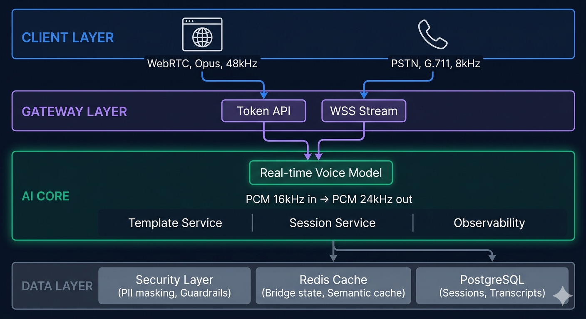

# Voice AI System Architecture

> **Luận điểm trung tâm:** Voice AI production = 20% model + 80% system engineering.
> Model giỏi đặt trong kiến trúc tệ → demo thành công, production thất bại.

Series này đi từ nền tảng audio cơ bản đến kiến trúc hệ thống production, giải thích tại sao 90% dự án Voice AI chỉ dừng lại ở demo.

---

## Tại sao cần đọc series này

Hầu hết developer tiếp cận Voice AI từ góc **model** — chọn GPT-4o hay Gemini, viết prompt thế nào, fine-tune ra sao. Nhưng thực tế challenge lớn nhất không nằm ở đó.

**80% thời gian và bug trong Voice AI production đến từ:**
- Audio codec không khớp giữa các thành phần
- Latency tích lũy qua nhiều bước xử lý
- Session state không nhất quán khi disconnect
- Barge-in (user ngắt lời AI) xử lý sai
- Security hole trong WebSocket connection

Series này giải quyết 80% đó.

---

## Learning Path

### Bài tổng quan

| # | Bài viết | Visual | Mô tả |
|---|----------|--------|-------|
| 00 | [Voice AI Architecture — Tổng quan](./00-overview.md) | [🎨 Visual](./00-overview-visual.html) | Toàn bộ bức tranh: 2 channel, 4 pipeline, các pattern production, cost analysis |

### Tầng 1 — Nền tảng (đọc trước)

Nếu chưa quen với audio số và realtime communication, đây là điểm bắt đầu bắt buộc. Tầng này giải thích *cái gì* đang được truyền, trước khi tầng 2 giải thích *truyền thế nào*.

| # | Bài viết | Visual | Khái niệm cốt lõi |
|---|----------|--------|-------------------|
| 01 | [Audio Fundamentals](./01-audio-fundamentals.md) ✅ | [🎨 Visual](./01-audio-fundamentals-visual.html) | PCM, sample rate, G.711, Opus |
| 02 | WebSocket & Realtime Communication | WebSocket vs HTTP, streaming, backpressure |
| 03 | Browser vs Phone — 2 Thế Giới Kết Nối | WebRTC/Opus vs PSTN/G.711, adapter pattern |

### Tầng 2 — Audio Engineering

Phần mà bài viết kỹ thuật phổ thông thường bỏ qua. Đây là lý do "demo chạy ngon, production nghe méo tiếng".

| # | Bài viết | Khái niệm cốt lõi |
|---|----------|-------------------|
| 04 | Audio Bridge — Demo vs Production | Codec chaining, quality loss, unified bridge |
| 05 | Inbound & Outbound Audio Pipeline | Upsample/downsample, buffer asymmetry |
| 06 | Latency Budget | Latency breakdown, P95, budget allocation |

### Tầng 3 — AI Pipeline

Phần mọi người thường biết nhưng chưa đủ sâu — đặc biệt là 4 kiến trúc đang cạnh tranh nhau trong 2024–2025.

| # | Bài viết | Khái niệm cốt lõi |
|---|----------|-------------------|
| 07 | 4 Kiến Trúc AI Pipeline | Cascaded, Speech-Native, Thinker-Talker, LLM+Codec |
| 08 | STT Deep Dive | Streaming vs batch, WER, Whisper vs Deepgram |
| 09 | TTS Deep Dive | Streaming TTS, TTFB, voice cloning |
| 10 | VAD & Barge-in State Machine | Voice Activity Detection, interrupt handling |

### Tầng 4 — System Architecture

Tầng ghép mọi thứ lại thành hệ thống production. Đọc sau khi đã hiểu 3 tầng trước.

| # | Bài viết | Khái niệm cốt lõi |
|---|----------|-------------------|
| 11 | Ephemeral Token & Security | Token flow, API key isolation, TTL |
| 12 | Unified Server Pattern | Anti-microservices, in-memory state, why it works |
| 13 | Optimization Patterns | Pre-connect, speculative tool calling, semantic cache |
| 14 | Observability & Monitoring | P95 latency, WER tracking, Langfuse |
| 15 | Cost Analysis | $0.10–0.22/min vs $4–10/min, cost roadmap |

---

## Sơ đồ kiến trúc tổng thể

**4 tầng hệ thống:**

- **CLIENT LAYER**: Browser (WebRTC, Opus 48kHz) + Phone (PSTN, G.711 8kHz via Twilio/Telnyx)
- **GATEWAY LAYER**: Token API (ephemeral keys) + WSS Stream (audio bridge)
- **AI CORE**: Real-time Voice Model (PCM 16kHz in / 24kHz out) + Template Service + Session Service + Observability
- **DATA LAYER**: Security Layer + Redis Cache + PostgreSQL Database

---

## Cách đọc series

**Nếu bạn mới:** Đọc tuần tự từ bài 01 đến 15. Mỗi bài ~8–12 phút đọc. Mỗi bài kết thúc bằng bridge sang bài tiếp theo.

**Nếu bạn đã có nền tảng audio:** Có thể bỏ qua tầng 1 (bài 01–03), bắt đầu từ tầng 2.

**Nếu bạn đang debug production:** Bài 04 (Audio Bridge), 06 (Latency Budget), và 14 (Observability) là 3 bài cần đọc nhất.

**Nếu bạn đang chọn kiến trúc:** Bài 07 (4 AI Pipeline Architectures) và 15 (Cost Analysis) là điểm bắt đầu.

---

## Trạng thái series

| Tầng | Bài | Markdown | Visual | Trạng thái |
|------|-----|----------|--------|------------|
| Tổng quan | [00 Overview](./00-overview.md) | ✅ | [🎨](./00-overview-visual.html) ✅ | ✅ Hoàn thành |
| Tầng 1 | [01 Audio Fundamentals](./01-audio-fundamentals.md) | ✅ | [🎨](./01-audio-fundamentals-visual.html) ✅ | ✅ Hoàn thành |
| Tầng 1 | 02 WebSocket & Realtime | 🔲 Chưa viết |
| Tầng 1 | 03 Browser vs Phone | 🔲 Chưa viết |
| Tầng 2 | 04 Audio Bridge | 🔲 Chưa viết |
| Tầng 2 | 05 Inbound/Outbound Pipeline | 🔲 Chưa viết |
| Tầng 2 | 06 Latency Budget | 🔲 Chưa viết |
| Tầng 3 | 07 AI Pipeline Architectures | 🔲 Chưa viết |
| Tầng 3 | 08 STT Deep Dive | 🔲 Chưa viết |
| Tầng 3 | 09 TTS Deep Dive | 🔲 Chưa viết |
| Tầng 3 | 10 VAD & Barge-in | 🔲 Chưa viết |
| Tầng 4 | 11 Ephemeral Token & Security | 🔲 Chưa viết |
| Tầng 4 | 12 Unified Server Pattern | 🔲 Chưa viết |
| Tầng 4 | 13 Optimization Patterns | 🔲 Chưa viết |
| Tầng 4 | 14 Observability | 🔲 Chưa viết |
| Tầng 4 | 15 Cost Analysis | 🔲 Chưa viết |
